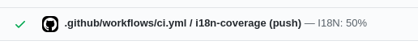
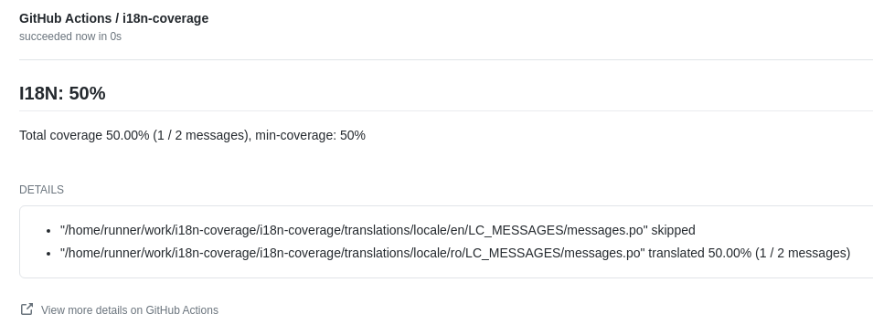

# i18n-coverage


Github action that can be used to measure how many of you translatable strings 
have a translation available. Currently supported formats:

 - [gettext .po files](https://www.gnu.org/software/gettext/manual/html_node/PO-Files.html)

The action can also attach a neutral/success/failure check to the head commit that triggered 
the workflow, with the coverage results for each found language.
  
## Example usage

Note, that you must include a checkout step before using this action in order to have the 
translations available. (Or any other alternative method ot get the translation files) 

```yaml
on: [push]

jobs:
  i18n-coverage:
    runs-on: ubuntu-latest
    name: Check i18n coverage
    steps:
      - uses: actions/checkout@v2
      - name: Check i18n coverage
        uses: alexkiro/i18n-coverage@v1.0.0
        with:
          token: ${{ secrets.GITHUB_TOKEN }}
          translations-path: 'translations/**/*.po'
          ignore-languages: 'en'
```

---

The total coverage percentage can also be retrieved from the output. E.g:

```yaml
on: [push]

jobs:
  i18n-coverage:
    runs-on: ubuntu-latest
    name: Check i18n coverage
    steps:
      - uses: actions/checkout@v2
      - name: Check i18n coverage
        id: i18nCoverage
        uses: alexkiro/i18n-coverage@v1.0.0
        with:
          token: ${{ secrets.GITHUB_TOKEN }}
          translations-path: 'translations/**/*.po'
          ignore-languages: 'en'
      - name: Get the coverage
        run: echo "The coverage was ${{ steps.i18nCoverage.outputs.coverage }}"
```

## Check results

The check details will be added to the triggered commit and will be displayed in GitHub. E.g:



Including the full details. E.g:



## Inputs

### `translations-path`

The glob patterns to the translations files to check. Defaults to "translations/**/*.po". 

### `token`

Github secret token, usually set to `${{ secrets.GITHUB_TOKEN }}`. If not specified the check details
are not attached to the commit, and therefore can only be found and used in the action workflow.

### `min-coverage`

The minimum coverage required for this check to be marked as success. If not set or set to 0 the 
check is marked as neutral. Float values are supported.

 - See sample pr for success: https://github.com/alexkiro/i18n-coverage/pull/1 
 - See sample pr for failure: https://github.com/alexkiro/i18n-coverage/pull/2 

### `ignore-languages`

Comma separated list of languages codes; if specified these languages will be excluded from the check.

### `only-languages`

Comma separated list of languages codes; if specified only these languages will be checked instead of all. 

## Outputs

### `coverage`

Total percentage of translated strings, across all checked languages.

----

## Development

Steps to prepare dev environment: 
 
 1. Ensure you have nodejs version 12+ installed
 2. Clone the repository
 3. Install dependencies: 
```
npm install
```
 4. (Optional) Compile messages:
```
./compilemessages.sh
```

The main code entrypoint is `src/index.js`

### Creating a new build 

This action is using @zeit/ncc to deploy the the index.js together with required dependencies.
A new build can be created using:

```
npm run build
``` 

This will update the dist/index.js file, which then needs to be committed and pushed to the repo. If 
this step is 

### Code style

The repo uses ESLint for linting. To lint and fix the code you can run:

```
npm run lint
```

### Tests

There are no automated tests, however the github workflow will currently run the latest version of the 
action on the `translations` folder in the repo. This functions as a very basic smoke test. 

The translations are managed using the sample code and the two scripts:

 - makemesssages.sh (updates po files)
 - compilemessages.sh (compiles po files into mo)
 